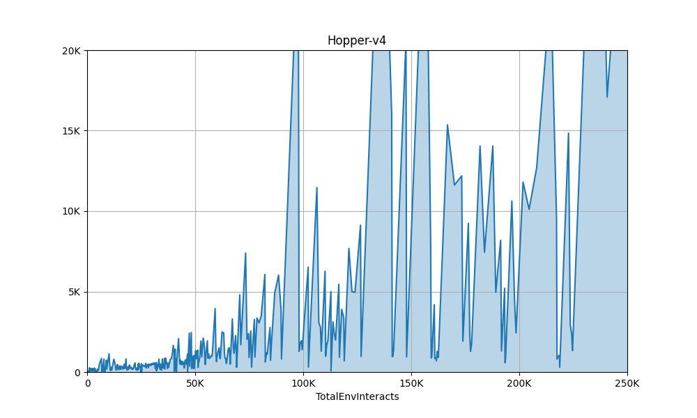

## Mujoco Agents - PyTorch based

This Project aimed to train models for MuJoCo Environments - Hopper, Half-Cheetah and Ant - in increasing order of complexity and number of joints. 

 

### Goal
1. Train SAC ✅ 
2. Implement Dagger ✅ 
3. Train Dagger
4. Combine them together

## Dependencies
1. PyTorch
2. OpenAI GYM ( >= 0.26.2 IMPORTANT!! No longer support for the previous versions)

### Running Instructions 
1. The Agents are housed in `agents/`
2. To run the training loops, execute `python main.py --env_name <ENV> --agent_type SAC --run_type train [optional tags]`
- `<ENV>` is one of Hopper-v4, HalfCheetah-v4 or Ant-v4 
- `<ALGO>` is one of SAC, Dagger or Mixer (Pending)
- The script for training the model are in `main.py` now, will move it shortly.
3. To run the evaluation loops, execute `python main.py --env_name <ENV> --agent_type SAC --run_type eval [optional tags]`, it will evaluate from existing models for 10 epoches, you can specify whether to store the gif.
4. `utils/` houses functionality for buffers and logging and operations for models.